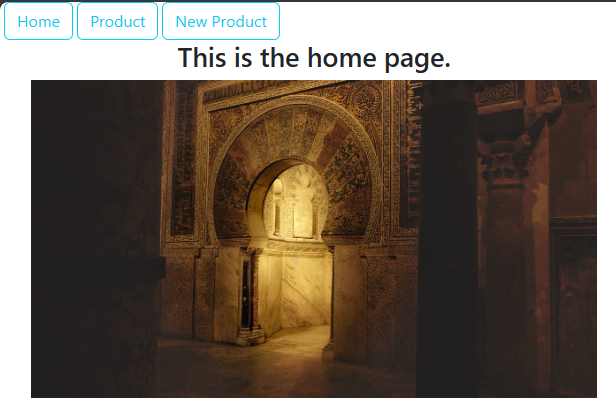
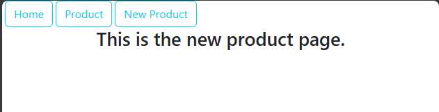
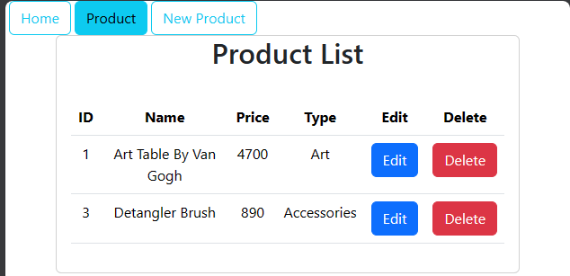
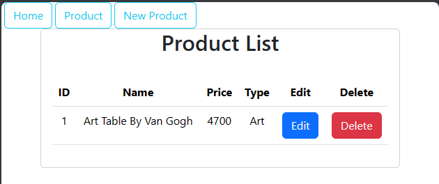
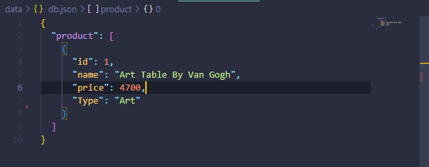

##  Project Management:
This is a reactjs project management products.

## How to use:
1. This is the home page:

2. This is the New Product Page

3. This is the Product page:

** In this product page, I get data displayed from a JSON server and then, I can manipulate this data by deleting and editing. **

3. 1. Here we deleted the Product with ID 3

3. 2. You can see in the `db.json` :

## Author:
- You can find me as [Josh Techie](https://github.com/Josh-techie)